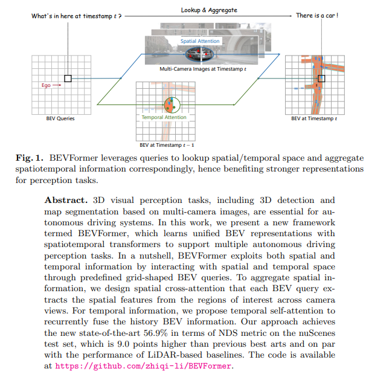
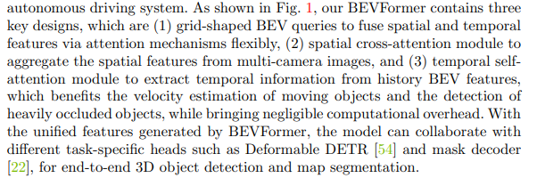
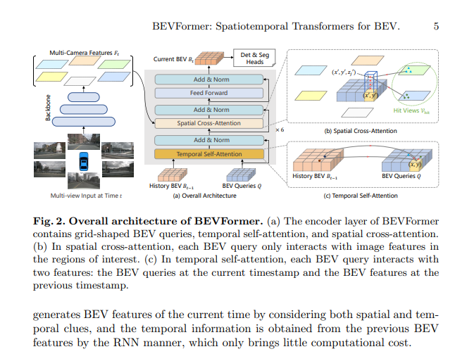
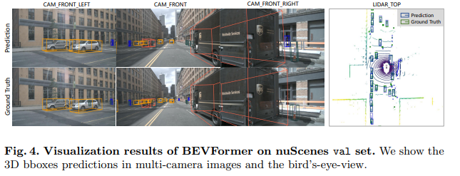
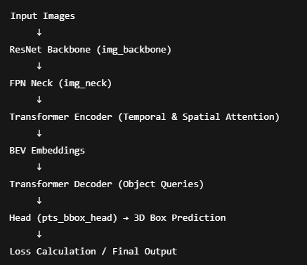

# BEVFormer

# Intro


# Key Components


# Architecture




# Flow


```plaintext
              +----------------+
              |  Input Image   |
              +----------------+
                      |
                      v
        +---------------------------+
        |  Image Backbone (ResNet)  |
        |  -> Extract deep features |
        +---------------------------+
                      |
                      v
        +---------------------------+
        |  Image Neck (FPN)         |
        |  -> Refine & aggregate    |
        |     image features        |
        +---------------------------+
                      |
                      v
        +---------------------------+
        |  BEVFormer Transformer    |
        |   (PerceptionTransformer) |
        +---------------------------+
                      |
         +------------+--------------+
         |                           |
         v                           v
+-----------------+     +-------------------------+
| Temporal Self   |     | Spatial Cross Attention |
| Attention       |     | + MSDeformableAttention |
+-----------------+     +-------------------------+
         \_____________________/
                  |
                  v
    +-----------------------------------+
    |  Transformer Decoder              |
    | (DetectionTransformerDecoder)     |
    | - Self-attn + Cross-attn on BEV   |
    | - Uses learned query embeddings   |
    +-----------------------------------+
                  |
                  v
    +-----------------------------------+
    |  Prediction Head (BEVFormerHead)  |
    |  - bbox reg / class logits        |
    +-----------------------------------+
                  |
                  v
         +--------------------+
         | Final 3D BBoxes    |
         +--------------------+
```
