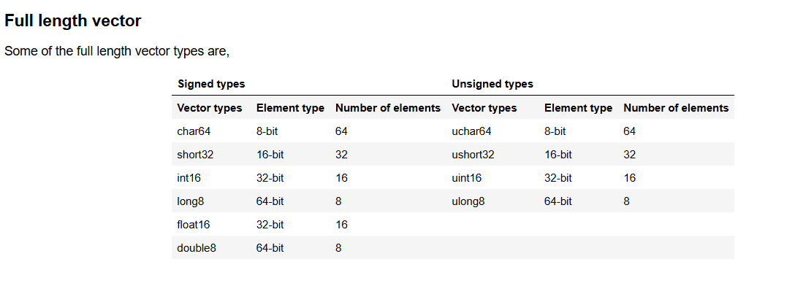

# Vector initialization¶
### Vectors can be initialized in multiple ways.

Initialize with a constant 
  
Initialize as an array 
 
Initialize using OpenCL accessors 

----
 

## High , low using opencl
 

 