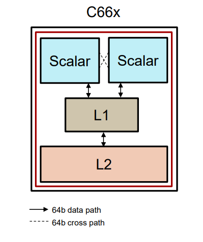
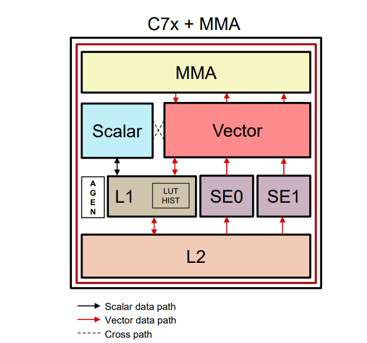
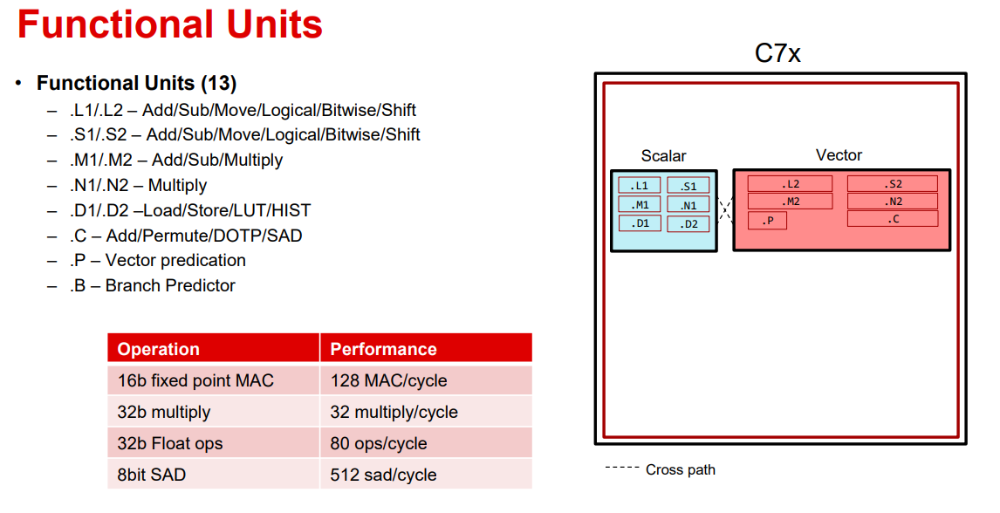
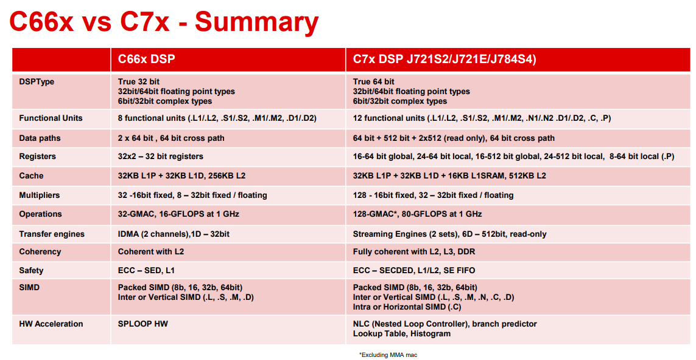
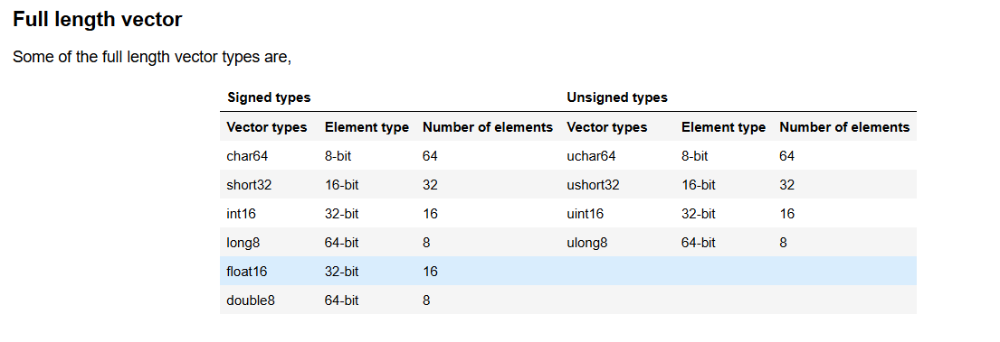
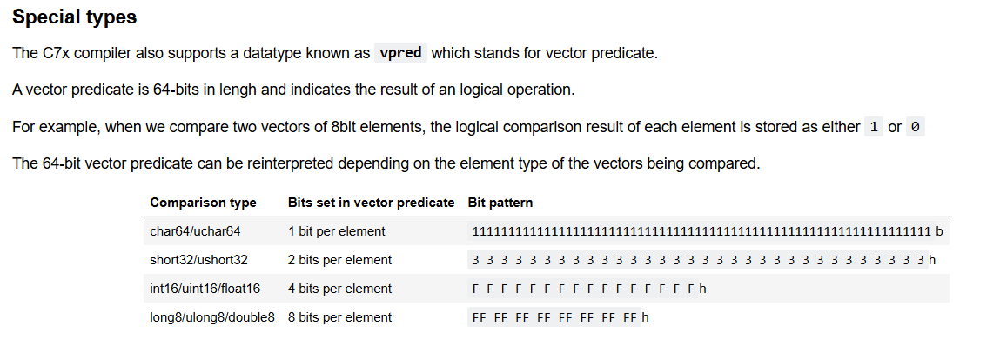

# C7x
Under the hood of C7x DSP  
– Data path  
– Functional Units  
– Register File  
– Streaming Engine  
– Memory  
– LUT/Histogram  
– ISA 

# C66x

# Streaming Engine
# Streaming Engines Overview

A streaming engine is a sophisticated hardware component designed to optimize data movement and formatting in high-performance DSP systems, ensuring efficient processing for applications that demand high data throughput. Below are its key features:

---

## 1. Data Forwarding Engine (Not a Transfer Engine)
- Its primary role is to **forward data** rather than manage memory transfers directly.
- Ensures **direct forwarding** of data:
  - From **L2 memory and beyond** to **CPU boundaries** (C7x processors).
  - To **MMA (Matrix Multiply Accelerator)** memories (A and B) in systems like AI accelerators.

---

## 2. Data Formatting Engine
- Facilitates advanced **data formatting operations** during data streaming:
  - **Element Promotion:** Converts smaller data types into larger ones (e.g., 8-bit to 16-bit).
  - **Decimation:** Skips data elements according to a specified stride.
  - **Duplication:** Replicates data elements for certain operations.
  - **Transpose Loads:** Rearranges matrix data for efficient processing in vectorized computations.
  - **Predication:** Enables conditional data operations based on specific conditions.

---

## 3. 6D Addressing
- **Six-dimensional (6D) addressing** allows for complex and programmable data access patterns:
  - Enables flexible indexing for multidimensional data arrays.
  - **Pre-programming of access patterns** ensures efficient handling of structured data.
- **Data presentation per cycle:**
  - **512-bit vectors** for platforms like **J721S2, J721E, J784S4**.
  - **256-bit vectors** for platforms like **AM62A**.
- Enhances performance by presenting structured, high-dimensional data in chunks optimized for vector processing.

---

## 4. Communication with Memory Controller
- Interfaces with the **L2 memory controller** for requests extending beyond **L2 memory**:
  - Supports access to **L3 memory** and **DDR (main memory)**.
- Ensures data **coherence** with **L1D cache**:
  - Maintains consistency at the **stream open/close boundaries**.

---

## 5. Read-Only Engine
- Designed exclusively as a **read-only** engine for **vector path feeding**:
  - Ensures high efficiency and prevents write-related overhead.
- Works seamlessly with vector-based processing pipelines.

---

## 6. Local Cache (2KB)
- Incorporates a **2KB local cache**:
  - Reduces traffic and latency when interacting with **L2 memory**.
  - Improves data throughput and minimizes memory access delays.

---

## Applications
The streaming engine is ideal for data-intensive applications like:
- **AI and Machine Learning:** Feeding structured data into accelerators (e.g., MMAs).
- **Multimedia Processing:** Optimizing video and audio data streams.
- **Scientific Computation:** Handling high-dimensional datasets efficiently.
- **Telecommunications:** Streamlining data flow in signal processing pipelines.

This architecture makes the streaming engine a critical component for achieving high computational efficiency in modern embedded and DSP platforms.

# Functional Unit

# C66x vs C7x 

# C7x Daatatype
Scalar Type 
Vector Type 

