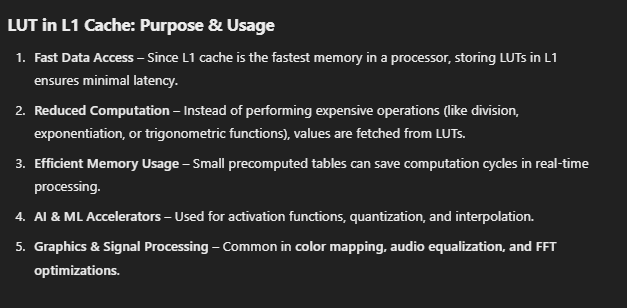
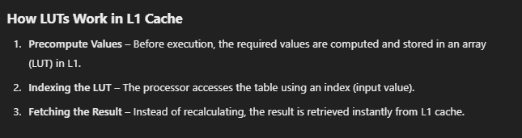

# Basics
## Address Generator

It Calculates the next read/ write address.

Generate memory address dynamically.

Have different access pattterns like linear, strides, scattered.

## Lookup table

<b>A Lookup Table (LUT) is a precomputed table used to speed up computations by replacing complex calculations with simple memory lookups.

