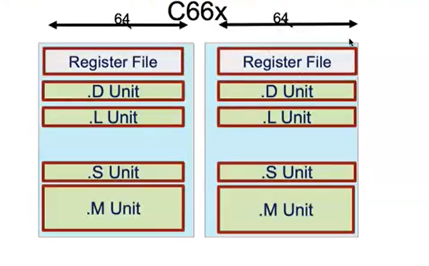
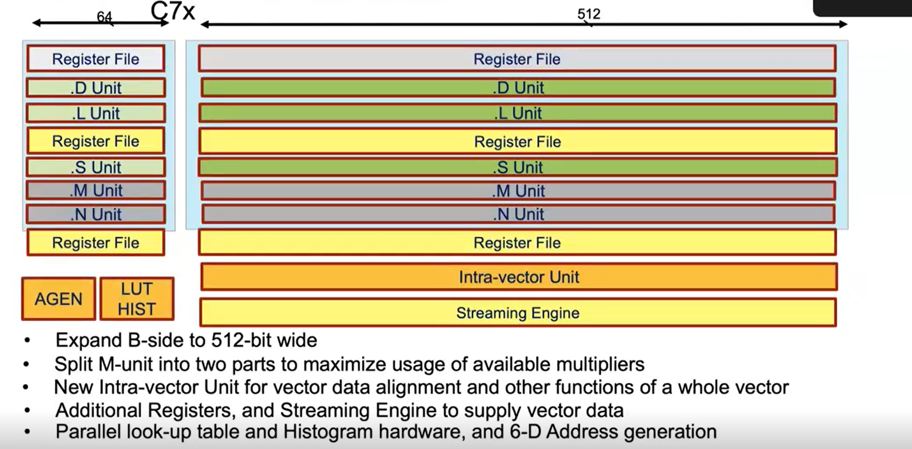
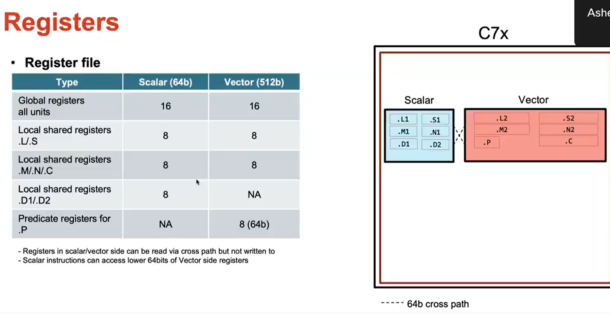
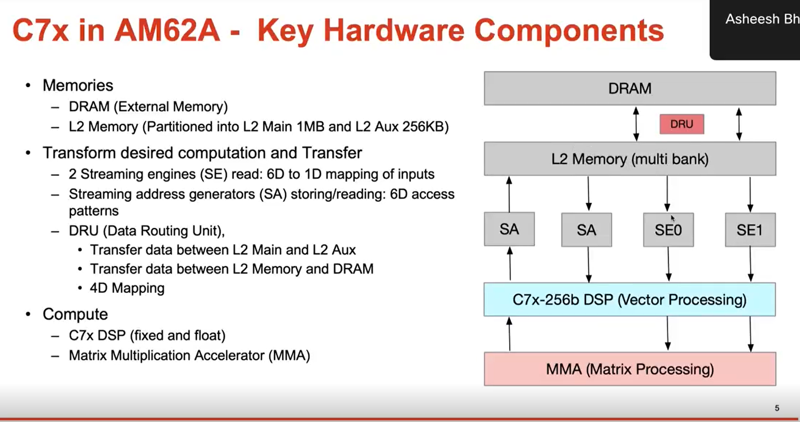
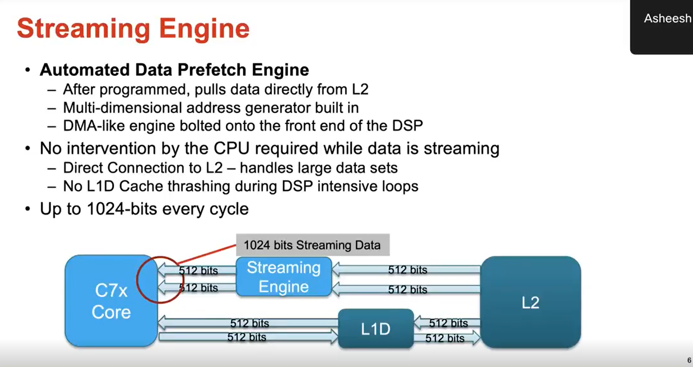
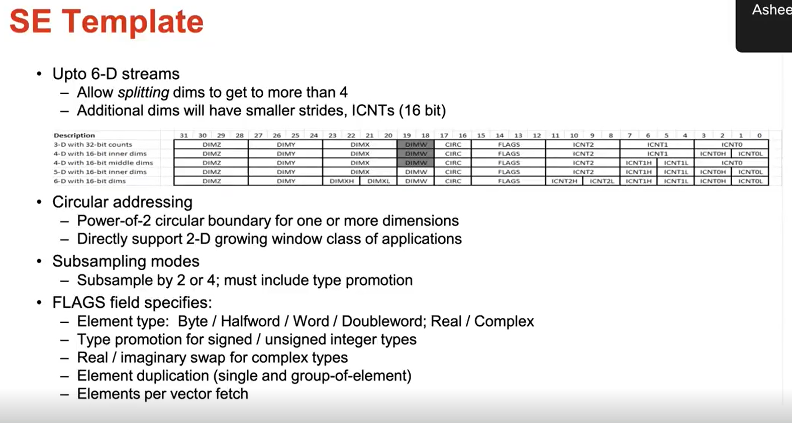
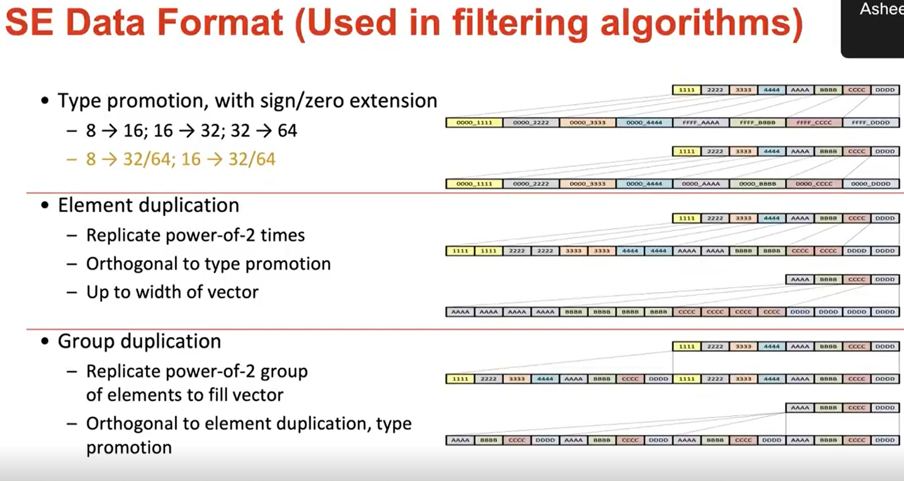
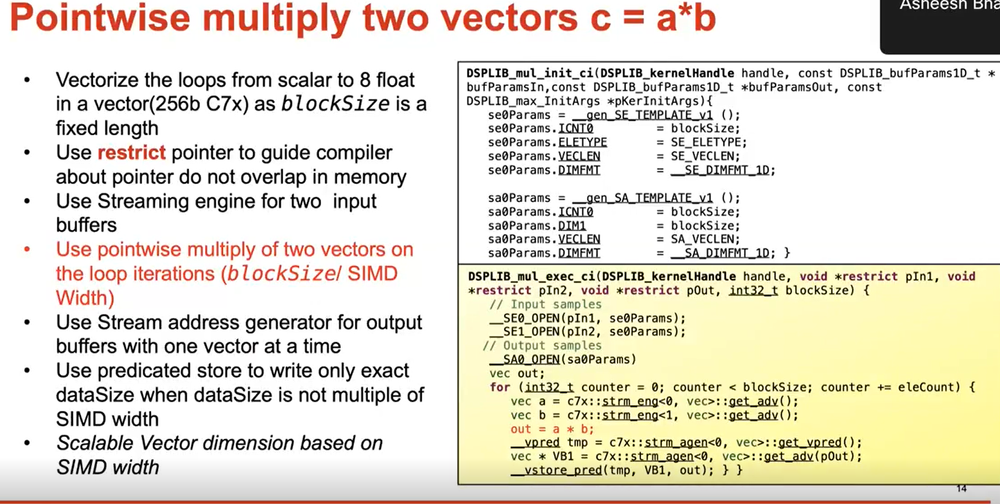
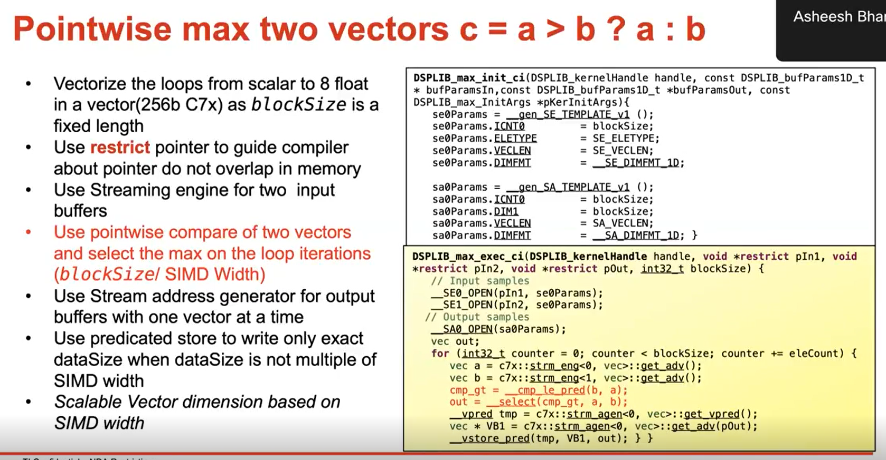
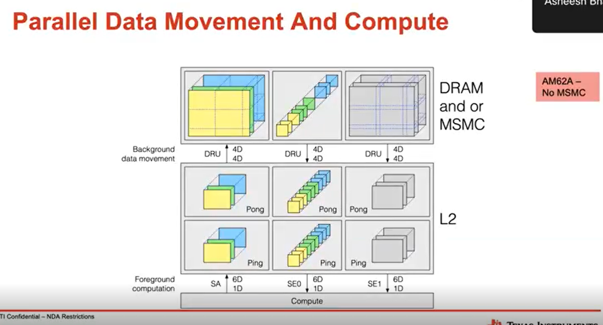

# C7x Viedo
## c66x

 A-side (left)                     B-side (right)  

## C7x

# Registers

# C7X Components

# Streaming engine

# Example

## Data Movement 

# keywords
ping pong buffer
circular buffer Addressing
Streaming Address only supports linear mode and not transpose mode