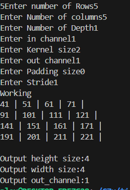

# CNN Operation (Scalar Types)

## Imports
```cpp
#include<iostream>
#include<vector>
#include "c7x.h"
#include "c7x_scalable.h"
using namespace c7x;
using namespace std;
```

## Generate Input
```cpp
void inp(int32_t r, int32_t c, int32_t ch,int32_t*** img){
    int32_t count =0;
    for(int i=0;i<ch;i++){
        for(int j=0; j<r; j++){
            for(int k=0; k<c; k++){
                img[i][j][k] = count++;
            }
        }
    }

}
```

## Generate kernel
```cpp
void filt(int32_t r, int32_t c, int32_t ch,int32_t chann,int32_t**** filter){
    int32_t count =1;
    for(int p=0;p<ch;p++){
        for(int i=0;i<chann;i++){
            for(int j=0; j<r; j++){
                for(int k=0; k<c; k++){
                    filter[p][i][j][k] = count++;
                }
            }
        }
    }
    

}
```

## Padding the input image
```cpp
void paddinpt(int32_t r, int32_t c, int32_t ch, int32_t*** img, int32_t*** padded,int32_t pad){
    for(int i=0;i<ch;i++){
        for(int j=0;j<(r+2*pad);j++){
            for(int k=0; k<(c+2*pad); k++){
                padded[i][j][k]=0;
            }
        }
    }

    for(int i=0; i<ch; i++){
        for(int j=0; j<r; j++){
            for(int k=0; k<c; k++){
                padded[i][j+pad][k+pad] = img[i][j][k];
            }
        }
    }
}
```

## Calculating Outputsize
```cpp
int32_t outsize(int32_t r, int32_t c, int32_t ch, int32_t p, int32_t st, int32_t ks){
    int32_t size =0;
    size = ((r-ks+(2*p))/st)+1;
    return size;
}
int32_t outsizec(int32_t r, int32_t c, int32_t ch, int32_t p, int32_t st, int32_t ks){
    int32_t sizec =0;
    sizec = ((c-ks+(2*p))/st)+1;
    return sizec;
}
int32_t outsizedc(int32_t r, int32_t c, int32_t depth, int32_t p, int32_t st, int32_t ks){
    int32_t sizec =0;
    sizec = ((depth-ks+(2*p))/st)+1;
    return sizec;
}
```
## My CNN function
```cpp
void myconv(int32_t ch, int32_t r_s, int32_t c_s, int32_t k, int32_t st, int32_t p, int32_t r,int32_t co, int32_t*** padded, int32_t*** img, int32_t*** cnn, int32_t**** filter, int32_t k_c,int32_t depth){
    for(int32_t c=0; c<k_c; c++){
        for(int32_t cc=0; cc<r_s; cc++){
            for(int32_t i=0; i<c_s; i++){
                for(int32_t j=0; j<depth; j++){
                    // for(int32_t d=0; d<ch; d++){
                        for(int32_t m=0; m<k; m++){
                            for(int32_t n=0; n<k; n++){
                                if((m+i*st) >= (r+2*p) || (n+j*st) >= (co+2*p)){
                                    continue;
                                }
                                cnn[c][cc][i] += padded[j][m+cc*st][n+i*st]*filter[c][j][m][n];
                            }
                        }
                    
                }
            }
        }
    }
}
```

## Inputs
```cpp
    int32_t row,column,channel,kernel,pad,stride,k_c;

    cout<<"Enter number of Rows:";
    cin>>row;
    cout<<"Enter Number of columns";
    cin>>column;
    cout<<"Enter Number of Depth";
    cin>>depth;
    cout<<"Enter in channel";
    cin>>channel;
    cout<<"Enter Kernel size";
    cin>>kernel;
    cout<<"Enter out channel";
    cin>>k_c;
    cout<<"Enter Padding size";
    cin>>pad;
    cout<<"Enter Stride";
    cin>>stride;

```
## This code dynamically allocates a 3D array using triple pointers
```cpp
int32_t*** img = new int32_t**[channel];
    for (int i = 0; i < channel; i++) {
        img[i] = new int32_t*[row];
        for (int j = 0; j < row; j++) {
            img[i][j] = new int32_t[column];
        }
    }

    int32_t**** filter = new int32_t***[k_c];
    for (int k = 0; k < k_c; k++) {
        filter[k] = new int32_t**[channel];
        for (int i = 0; i < channel; i++) {
            filter[k][i] = new int32_t*[kernel];
            for (int j = 0; j < kernel; j++) {
                filter[k][i][j] = new int32_t[kernel];
            }
        }
    }

    int32_t*** padded = new int32_t**[channel];
    for (int i = 0; i < channel; i++) {
        padded[i] = new int32_t*[row + 2 * pad];
        for (int j = 0; j < row + 2 * pad; j++) {
            padded[i][j] = new int32_t[column + 2 * pad];
        }
    }
```
---

## CNN operation demo
- Image size: 5X5X2
- Kernel size: 3X3X2
- padding: 0
- Stride: 1
- <b>Outputsize: 3X3X2</b>


---
# CNN for 100X100X64
- Image size: 100X100X64
- Kernel size: 1X1
- padding: 0
- Stride: 1
- <b>Outputsize: 100X100</b>


---




