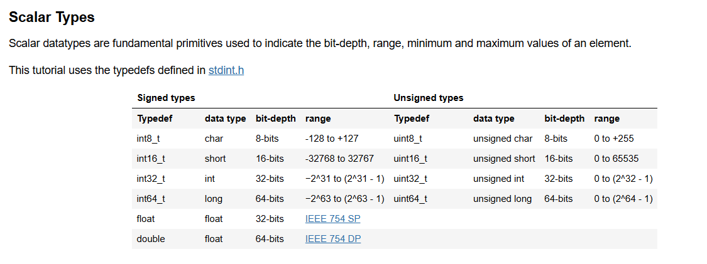
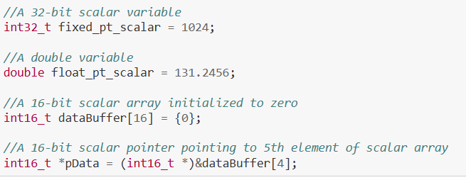
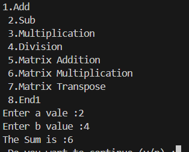
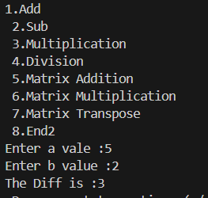
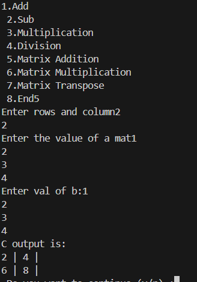
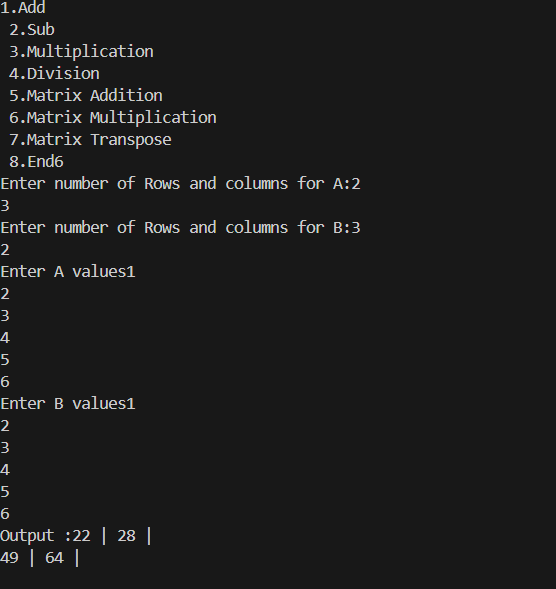
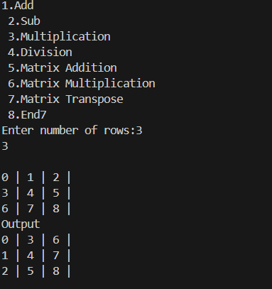

# Basic
## Scalar Types



# Code
## 1 : Scalar ADD
```cpp
void add(int32_t a, int32_t b){
    int32_t c = a+b;
    cout<<"The Sum is :"<<c;

}
```
### output


## 2 : Scalar SUB
```cpp
void sub(int32_t a, int32_t b){
    int32_t c = a-b;
    cout<<"The Diff is :"<<c;

}
```
### Output


## 3 and 4: Mul and div
```cpp
void mul(int32_t a, int32_t b){
    int32_t c = a*b;
    cout<<"The Mul is :"<<c;

}
void divd(int32_t a, int32_t b){
    float c = a/b;
    cout<<"The Div is :"<<c;

}
```
## 5: Matrix Addition (Scalar Array)
```cpp
void matadd(){
    cout<<"Enter rows and column";
    int32_t r,c;
    cin>>r;
    cin>>c;
    int32_t a[r*c];
    int32_t b[r*c];
    cout<<"Enter the value of a mat";
    for(int32_t i=0; i<(r*c); i++){
        cin>>a[i];
    }
    cout<<"Enter val of b:";
    for(int32_t i=0; i<(r*c); i++){
        cin>>b[i];
    }
    int res[r*c];
    for(int32_t i=0; i<(r*c); i++){
        res[i]=a[i]+b[i];
    }
    cout<<"C output is:";
    for(int32_t i=0; i<(r*c); i++){
        if(i%(c)==0){
            cout<<"\n";
        }
        cout<<res[i]<<" | ";
    }


}
````
### Output


## 6 : Marix Multiplication
```cpp
void matmul(){
    cout<<"Enter number of Rows and columns for A:";
    int32_t r1,c1;
    cin>>r1;
    cin>>c1;
    cout<<"Enter number of Rows and columns for B:";
    int32_t r2,c2;
    cin>>r2;
    cin>>c2;
    if(c1!=r2){
        cout<<"Enter valid dimensions!!!!!!!! \n";
        return;
    }
    int32_t a[r1][c1];
    int32_t b[r2][c2];
    int32_t c[r1][c2];
    for (int32_t i = 0; i < r1; i++) {
        for (int32_t j = 0; j < c2; j++) {
            c[i][j] = 0;
    }
}

    cout<<"Enter A values";
    for(int32_t i=0;i<r1;i++){
        for(int32_t j=0;j<c1;j++){
            cin>>a[i][j];
        }
    }
    cout<<"Enter B values";
    for(int32_t i=0;i<(r2);i++){
        for(int32_t j=0; j<c2; j++){
            cin>>b[i][j];
        }
    
    }
    for(int32_t i=0; i<r1; i++){
        for(int32_t j=0; j<c2; j++){
            for(int32_t k=0; k<c1; k++){
                c[i][j]+=a[i][k]*b[k][j];
            }
        }

    }

    cout<<"Output :";
    for(int32_t i=0;i<r1;i++){
        for(int32_t j=0; j<c2; j++){
            cout<<c[i][j]<<" | ";
        }
        cout<<"\n";
    }
}
```

### output


## 7: Matrix Transpose
```cpp
void mattrans(int32_t r, int32_t c){
    int32_t res[r][c];
    int32_t count=0;
    cout<<"\n";
    for(int32_t i=0; i<r; i++){
        for(int32_t j=0; j<c; j++){
            res[i][j]=count;
            count++;
        }
    }
    
    for(int32_t i=0; i<r; i++){
        for(int32_t j=0; j<c; j++){
            cout<<res[i][j]<<" | ";
        }
        cout<<"\n";
    }
    
    for(int32_t i=0;i<r;i++){
        for(int32_t j=0; j<i; j++){
            int32_t temp = res[j][i];
            res[j][i]=res[i][j];
            res[i][j]=temp;
        }
    }
    cout<<"Output \n";
    for(int32_t i=0; i<r; i++){
        for(int32_t j=0; j<c; j++){
            cout<<res[i][j]<<" | ";
        }
        cout<<"\n";
    }

}
```
### output

