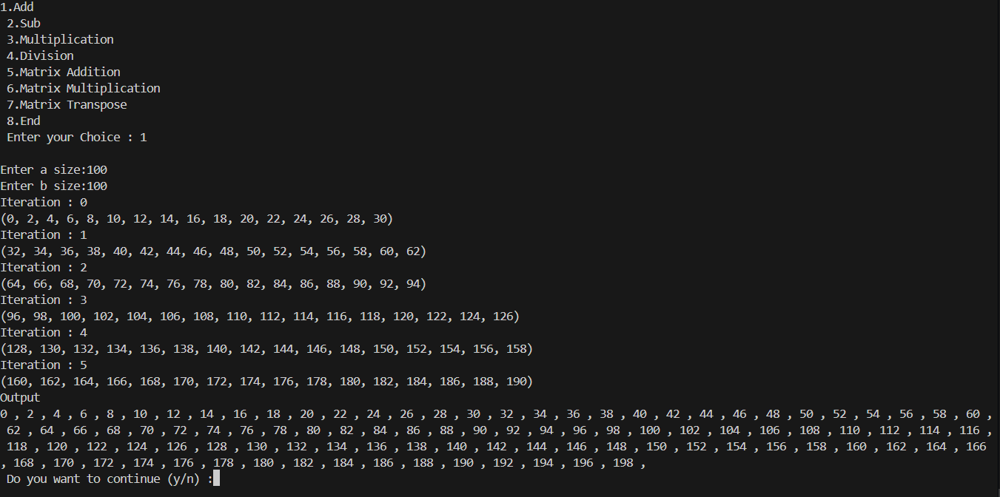
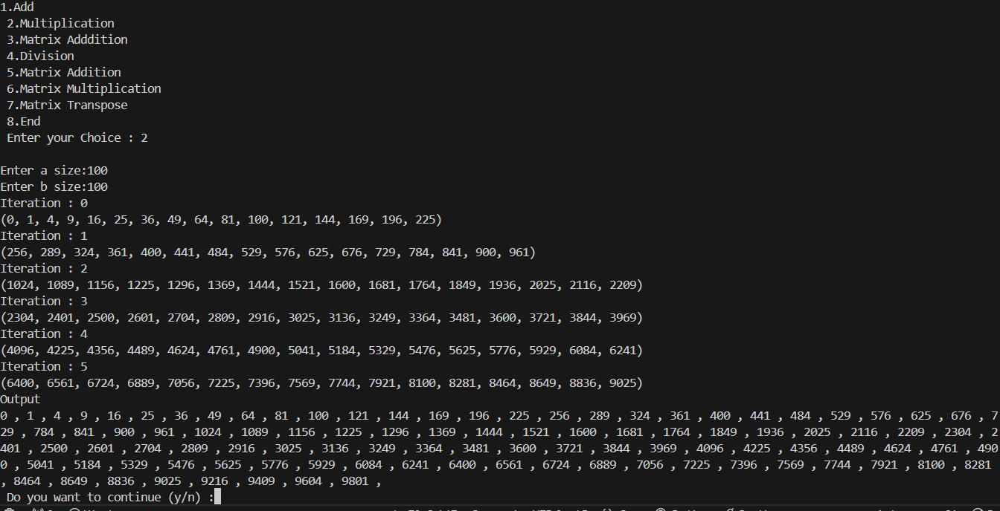

# Vectorization
## code
## 1: ADD
```cpp
void add(int32_t a, int32_t b){
    int32_t c[a];
    int32_t d[b];
    for(int i=0; i<a; i++){
        c[i]=i;
    }
    for(int32_t j=0; j<b; j++){
        d[j]=j;
    }
    int32_t *va = &c[0];
    int32_t *vb = &d[0];
    int32_t m = 0;
    if(a>b){
        m=a;
    }
    else{
        m=b;
    }
    int32_t res[m];
    for(int i=0; i<m; i++){
        res[i]=0;
    }
    int32_t *vc = &res[0];
    const int vec_len = element_count_of<int_vec>::value;
    int32_t i=0;
    int32_t iter=0;
    for(i=0; i<m; i+=vec_len){
        if((i+vec_len)>m){
            break;
        }
        int_vec vina = *(int_vec *)(va+i);
        int_vec vinb = *(int_vec *)(vb+i);
        int_vec vinc = vina+vinb;
        *(int_vec *)(vc+i) = vinc;
        cout<<"Iteration : "<<iter++<<"\n";
        vinc.print();

    }
    for(int32_t j=i; j<m; j++){
        res[j]=c[j]+d[j];
    }
    cout<<"Output \n";
    for(int i=0;i<m;i++){
        cout<<res[i]<<" , ";
    }
}
```
### output:


## 2: Multiplication
```cpp
void mul(int32_t a, int32_t b){
    int32_t c[a];
    int32_t d[b];
    for(int i=0; i<a; i++){
        c[i]=i;
    }
    for(int32_t j=0; j<b; j++){
        d[j]=j;
    }
    int32_t *va = &c[0];
    int32_t *vb = &d[0];
    int32_t m = 0;
    if(a>b){
        m=a;
    }
    else{
        m=b;
    }
    int32_t res[m];
    for(int i=0; i<m; i++){
        res[i]=0;
    }
    int32_t *vc = &res[0];
    const int vec_len = element_count_of<int_vec>::value;
    int32_t i=0;
    int32_t iter=0;
    for(i=0; i<m; i+=vec_len){
        if((i+vec_len)>m){
            break;
        }
        int_vec vina = *(int_vec *)(va+i);
        int_vec vinb = *(int_vec *)(vb+i);
        int_vec vinc = vina*vinb;
        *(int_vec *)(vc+i) = vinc;
        cout<<"Iteration : "<<iter++<<"\n";
        vinc.print();

    }
    for(int32_t j=i; j<m; j++){
        res[j]=c[j]*d[j];
    }
    cout<<"Output \n";
    for(int i=0;i<m;i++){
        cout<<res[i]<<" , ";
    }


}

```
### output



## 3: Matrix Addition (NXM)
```cpp
void matadd(int16_t a, int16_t b){

    int16_t arr[a][b];
    int16_t arrb[a][b];
    int16_t c[a][b];
    int16_t co=0;
    for(int16_t i=0; i<a; i++){
        for(int16_t j=0; j<b; j++){
            arr[i][j] = co++;
        }
    }
    co=0;
    for(int16_t i=0; i<a; i++){
        for(int16_t j=0; j<b; j++){
            arrb[i][j] = co++;
        }
    }
    for(int16_t i=0; i<a; i++){
        for(int16_t j=0; j<b; j++){
            c[i][j] = 0;
        }
    }

    for(int16_t i=0; i<a; i++){
        for(int16_t j=0; j<b; j++){
            cout<<arr[i][j]<<" | ";
        }
        cout<<"\n";
    }

    int16_t *idx = &arr[0][0];
    int16_t *idxb = &arrb[0][0];
    int16_t *idxc = &c[0][0];

    const int vec_len = element_count_of<short_vec>::value;
    int16_t i=0;
    for(i=0;i<a;i++){
        int j=0;
        for(j=0; j<b; j+=vec_len){
            
            if(j+vec_len>b){
                idx+=b-j;
                idxb+=b-j;
                idxc+=b-j;
                break;
            }
            short_vec veca = *(short_vec *)(idx);
            short_vec vecb = *(short_vec *)(idxb);
            cout<<"Vec a";
            veca.print();
            cout<<"Vec b";
            vecb.print();
            cout<<"vec c";
            short_vec vecc = veca + vecb;
            *(short_vec *)(idxc) = vecc;
            vecc.print();
            idx+=vec_len;
            idxb+=vec_len;
            idxc+=vec_len;
            cout<<"\n";
        }
        for(int k=j; k<b; k++){
            c[i][k] = arr[i][k]+arrb[i][k];
        }

    }
    cout<<"Output";
    for(int16_t m=0; m<a; m++){
        for(int16_t n=0; n<b; n++){
            cout<<c[m][n]<<" | ";
        }
        cout<<"\n";
    }
}
```