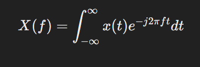
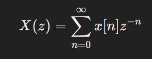

#  **DSP**

### Analog vs Discrete Signal

### Block Diagram

### Application

# ***Summary***

## Sequences

sampling
--------
Is the process of converting a continuous signal into a discrete-time signal.

## What is a Transform in DSP?
A transform in DSP is a mathematical tool that helps analyze and manipulate signals by converting them into a different domain (like from time to frequency).

### Time Domain: 
Where you see how a signal changes over time (e.g., a sine wave or audio waveform).
### Frequency Domain: 
Where you see what frequencies are present in the signal and their magnitudes (e.g., a spectrum analyzer).
## Why Use Transforms?
#### Simplifies Signal Processing: 
Some operations (like filtering) are easier in the frequency domain.
#### Reveals Hidden Patterns: 
Transforms show signal components like frequencies, harmonics, or noise.
#### Compression: 
Helps reduce data (e.g., JPEG uses DCT for image compression).
# Key Concepts to Understand Before Transforms
## Signals:

A signal is a function that conveys information (e.g., sound, temperature, images).
### Types of signals:
Continuous: Changes continuously over time (e.g., analog audio).
Discrete: Measured at intervals (e.g., digital audio samples).
## Frequency:

Describes how fast a signal oscillates.
Unit: Hertz (Hz), where 1 Hz = 1 cycle per second.
## Spectrum:

The spectrum is the representation of signal frequencies.
## Periodic Signals:

Repeat over time (e.g., a sine wave).
Described using sinusoidal components.

# Basic Transforms in DSP

## 1. Fourier Transform (FT)
Converts a time-domain signal into its frequency-domain representation.

### What it Does:
- Breaks a signal into sinusoidal components (sine and cosine waves).
- Each frequency has a magnitude and phase.

### Equation:
For a continuous signal  

### Key Points:
- \( X(f) \): Frequency domain representation.
- \( t \): Time.
- \( f \): Frequency.
- \( e^{-j2\pi ft} \): Represents complex sinusoids.

### Applications:
- Audio equalizers.
- Spectral analysis.

---

## 2. Discrete Fourier Transform (DFT)
Used for discrete signals (sampled at intervals). A DFT is the digital equivalent of the Fourier Transform.

### Equation:
For \( N \) samples:

### Key Points:
- \( X[k] \): Frequency bin \( k \).
- \( x[n] \): Signal value at sample \( n \).

### Fast Fourier Transform (FFT):
- Efficient algorithm for computing DFT.
- Widely used due to its speed.

---

## 3. Laplace Transform
Used for continuous signals to analyze systems and solve differential equations.

### Equation:

### Key Points:
- \( s \): Complex frequency (\( s = \sigma + j\omega \)).

### Applications:
- System stability analysis.
- Control systems.

---

## 4. Z-Transform
For discrete signals, the Z-transform is the counterpart to the Laplace Transform.

### Equation:

### Key Points:
- \( z \): Complex variable.

### Applications:
- Digital filter design.
- Discrete-time system analysis.

----

# Basics to kmow
### Types of signals

-----
## Convolution

---

