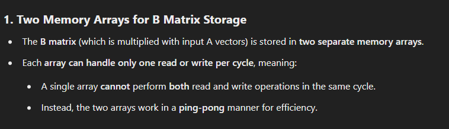

# MMA (Matrix Multiply Accelerator)
- The Matrix Multiply Accelerator (MMA) is a tightly coupled matrix multiplication coprocessor that extends the C7x
processor architecture's scalar and vector facilities
- Fed through the streaming engines (SEs), the MMA provides
a large number of <mark>multiply-accumulate (MAC) </mark>operations, matrix-optimized storage, and matrix-optimized data
movement that can be efficiently used for the dense linear algebra operations that dominate the computations
found in vision (CNNs, SfM, filtering, and so forth), speech (xNNs), audio (convolutions), radar (FFTs) and
controls (reinforcement learning, state updates) based applications.

# Calculations
- MMA computes the product of a row vector (A) with a square matrix (B)
- The row vector that results from this
operation can be combined with a row vector in the square matrix C
-  written back to a row in C

# Overall
<b>Fundamentally, MMA computes the vector dot product of row-vector operand A with each the columns of matrix
operand B and accumulates the dot products into a row of matrix C with a throughput of one clock cycle.</b>

## Row Vector A Storage
A single 512-bit array is provided for the A row vector

## B Matrix Storage in MMA (Matrix-Matrix Accumulate)
The B matrix storage in the MMA (Matrix-Matrix Accumulate) unit uses two memory arrays designed to efficiently handle matrix multiplication operations. These arrays are optimized for high-performance computing by leveraging a double-buffering (ping-pong) technique.

## C Matrix Storage in MMA (Matrix-Matrix Accumulate)
The C matrix storage in the MMA (Matrix-Matrix Accumulate) unit is responsible for storing the results of matrix multiplications. It has two memory arrays, similar to the B matrix storage, but with key differences in access speed, storage structure, and usage.

