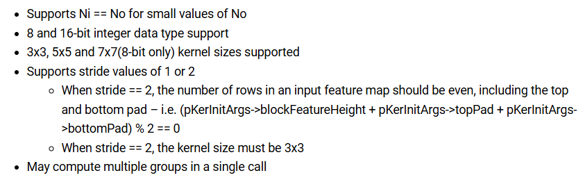

# MMALIB_CNN_convolve_col_smallNo_ixX_ixX_oxX

- Kernel for computing CNN-style 2D convolution using <mark>column major </mark> data ordering on the input and output feature maps.

- The kernel is designed to process a <mark>pair of MMA-wide columns </mark>at a time, although processing a single column is supported.

