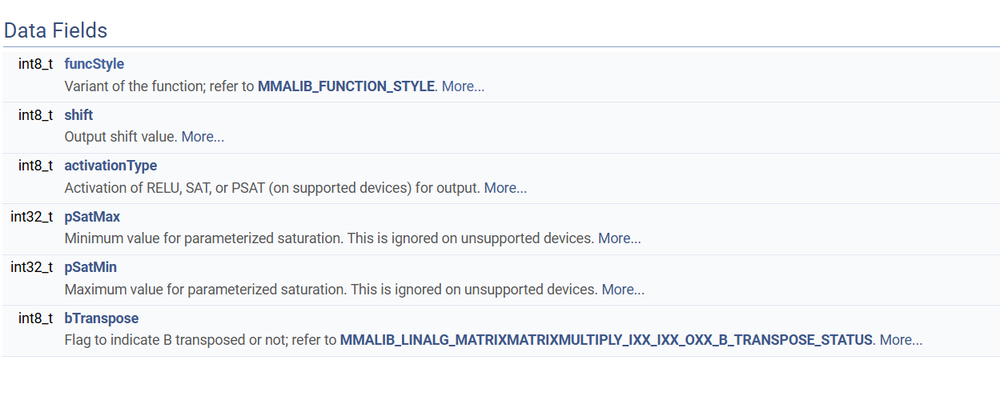
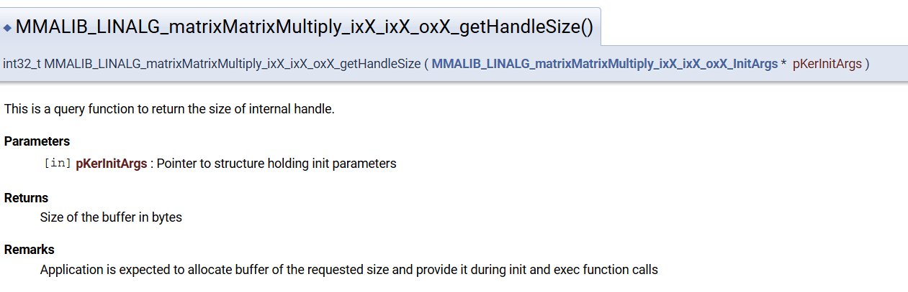
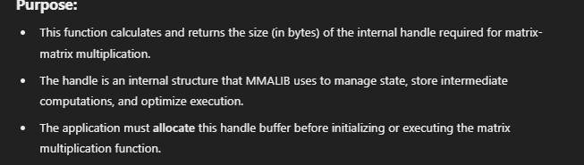
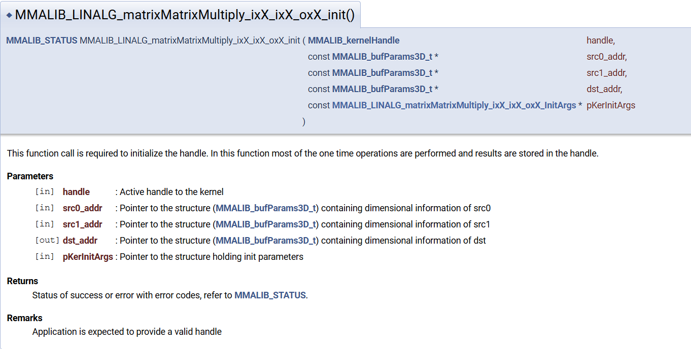
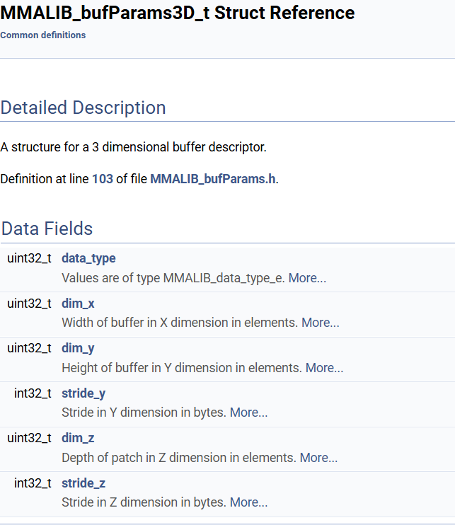
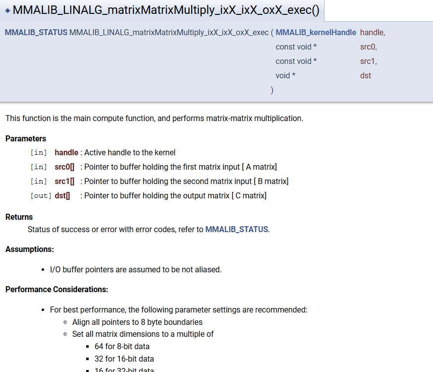
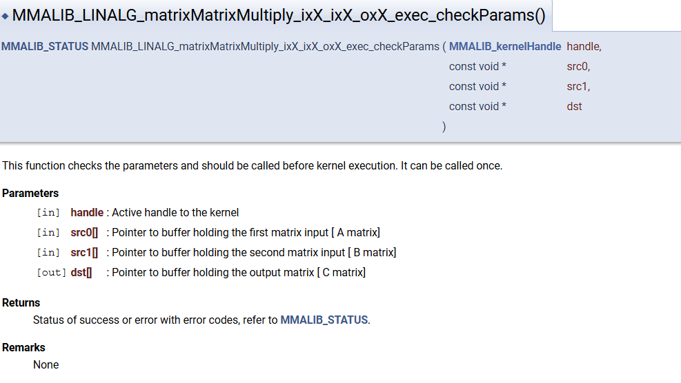

# MMALIB_LINALG_matrixMatrixMultiply_ixX_ixX_oxX_InitArgs

# MMALIB_LINALG_matrixMatrixMultiply_ixX_ixX_oxX_getHandleSize()

# MMALIB_LINALG_matrixMatrixMultiply_ixX_ixX_oxX_init()

## bufparmas3D

# MMALIB_LINALG_matrixMatrixMultiply_ixX_ixX_oxX_init_checkParams()
- This function checks the parameters and should be called before kernel executuon. It can be called once.

# MMALIB_LINALG_matrixMatrixMultiply_ixX_ixX_oxX_exec()
- It performs Matrix Multiplication.

# cgeck params for exec

# Understanding the handle
- The handle is a pointer used to manage kernel execution and resources efficiently.
- It acts as a <mark>context object, storing information needed for the kernel function </mark>(like matrix dimensions, data addresses, and optimizations).