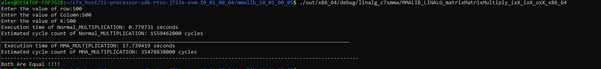

# MMALIB_LINALG_matrixMatrixMultiply_ixX_ixX_oxX_d
- This kernel performs Matrix Multiplication operation
- A matrix of dimension (M X K)
- B matrix of dimension (K X N)
- <b>C = A X B </b>
- result Martix C : (M X N)

# Comparision with normal Matrix Multiplication

