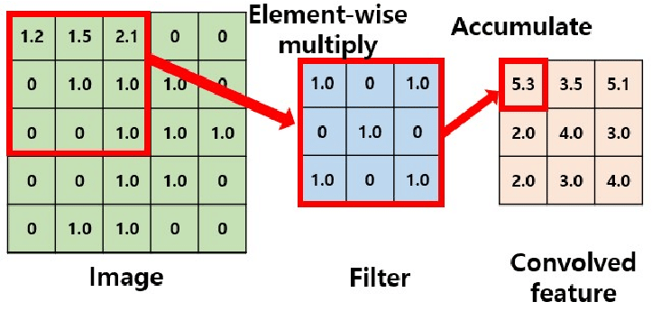

# Supported Layers:
## Convolution Layer:
- It applies filters (kernels) to input images or feature maps to detect patterns like edges, textures, and objects.
- Used in image processing, object detection, and segmentation.

## Spatial Pooling Layer

### Max Pooling

### Average Pooling

### diff 

## RELU

- Max(0,val);

## Element Wise Layer
<b>Add, Product and Max</b>

## Inner Product layer
<b>Fully connected layer</b>

## Soft Max
- Softmax function is a mathematical function that converts a vector of raw prediction scores (often called logits) from the neural network into probabilities.

## Bias Layer

- The constant which is added to the product of features and weights.
- It is used to offset the result.
- It helps the models to shift the activation function towards the positive or negative side

## Concatenate layer

## Scale Layer
