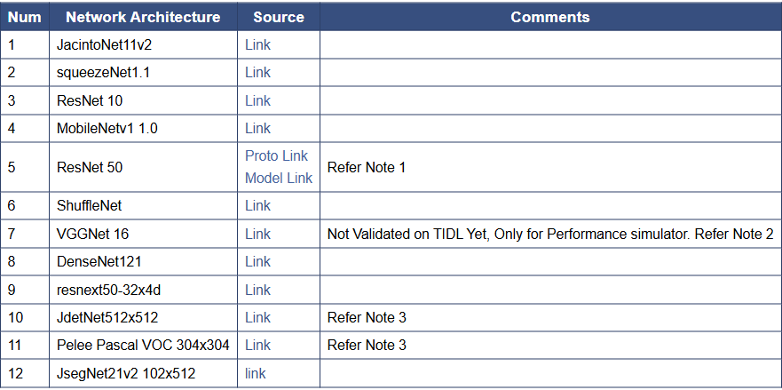
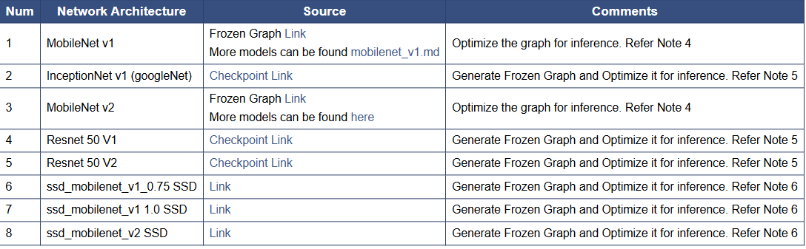
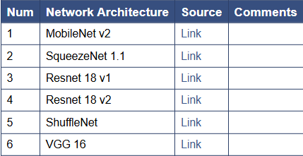

# Supported Models

# Caffe Models:
- Caffe <b>(Convolutional Architecture for Fast Feature Embedding)</b> is a deep learning framework
- It is widely used for image classification, object detection, and segmentation.

- Models:

# Tensorflow Models:
- These models can be used for tasks like image classification, object detection, speech recognition, and NLP (natural language processing).

# ONNX Models:
- ONNX (Open Neural Network Exchange)
-  It allows models trained in different frameworks (like TensorFlow, PyTorch, Scikit-learn, etc.) to be shared and deployed across different platforms.

# 📌 Model Summary (Caffe, TensorFlow, ONNX)

| **Num** | **Network Architecture** | **Framework** | **Description** |
|--------|--------------------------|--------------|----------------|
| 1 | **JacintoNet11v2** | Caffe | A lightweight CNN optimized for embedded AI applications. |
| 2 | **SqueezeNet 1.1** | Caffe / ONNX | A small, efficient CNN with AlexNet-level accuracy but fewer parameters. |
| 3 | **ResNet 10** | Caffe | A compact version of ResNet with 10 layers, optimized for speed. |
| 4 | **MobileNet v1 1.0** | Caffe | A lightweight CNN for mobile and embedded vision applications. |
| 5 | **ResNet 50** | Caffe / TensorFlow | A 50-layer deep ResNet architecture, widely used for classification tasks. |
| 6 | **ShuffleNet** | Caffe / ONNX | An efficient CNN optimized for mobile devices using channel shuffling. |
| 7 | **VGGNet 16** | Caffe / ONNX | A deep CNN with 16 layers, popular in image classification tasks. |
| 8 | **DenseNet121** | Caffe | A CNN with densely connected layers, reducing parameters and improving efficiency. |
| 9 | **ResNeXt50-32x4d** | Caffe | A variant of ResNet with grouped convolutions for better performance. |
| 10 | **JdetNet 512x512** | Caffe | A detection network optimized for 512x512 input size. |
| 11 | **Pelee Pascal VOC 304x304** | Caffe | A lightweight object detection model trained on Pascal VOC dataset. |
| 12 | **JsegNet21v2 102x512** | Caffe | A segmentation model optimized for real-time inference. |
| 13 | **MobileNet v1** | TensorFlow | A small, fast CNN optimized for mobile and edge devices. |
| 14 | **InceptionNet v1 (GoogleNet)** | TensorFlow | A deep CNN with an inception module for better efficiency. |
| 15 | **MobileNet v2** | TensorFlow / ONNX | An improved MobileNet architecture with better accuracy and efficiency. |
| 16 | **ResNet 50 V1** | TensorFlow | A deep residual network with 50 layers for image classification. |
| 17 | **ResNet 50 V2** | TensorFlow | An improved version of ResNet 50 with better training optimization. |
| 18 | **SSD MobileNet v1 0.75 SSD** | TensorFlow | A single-shot detection (SSD) model with MobileNet v1. |
| 19 | **SSD MobileNet v1 1.0 SSD** | TensorFlow | An SSD model with MobileNet v1, optimized for object detection. |
| 20 | **SSD MobileNet v2 SSD** | TensorFlow | An SSD model with MobileNet v2, better optimized for mobile applications. |
| 21 | **ResNet 18 v1** | ONNX | A smaller ResNet variant with 18 layers for faster inference. |
| 22 | **ResNet 18 v2** | ONNX | An improved version of ResNet 18 with better optimization. |
