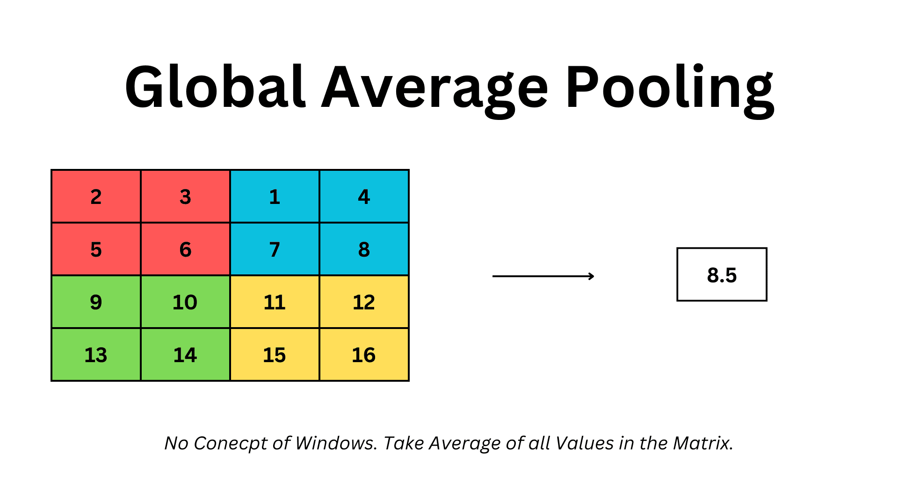

# Layers in Resnet 18
- conv  -   TIDL_ConvolutionLayer
- Relu  -   TIDL_ConvolutionLayer (Relu will be merged in conv)
- BatchNormalization     -    TIDL_BatchNormLayer
- Max Pool   -   TIDL_PoolingLayer
- Add   -   TIDL_EltWiseLayer
- Global Average Pool   -    	TIDL_PoolingLayer
- Flatten     -     TIDL_FlattenLayer
- Gemm    -     TIDL_InnerProductLayer

# Conv
- It applies filters (kernels) to input images or feature maps to detect patterns like edges, textures, and objects.
- Used in image processing, object detection, and segmentation.

# Relu
- Max(0,val);

# BatchNormalization

# Max Pool 

# Add
- Just does element wise 

# Global Average Pool

# Flatten
- A neural network flatten layer is used to convert the multi-dimensional output from the previous layer into a one-dimensional array, typically before feeding it into a fully connected layer for further processing.

# Gemm
- GEMMs (General Matrix Multiplications) 
