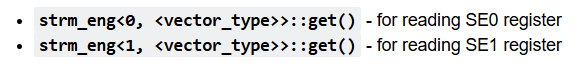
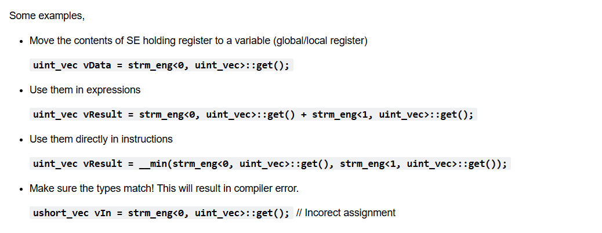
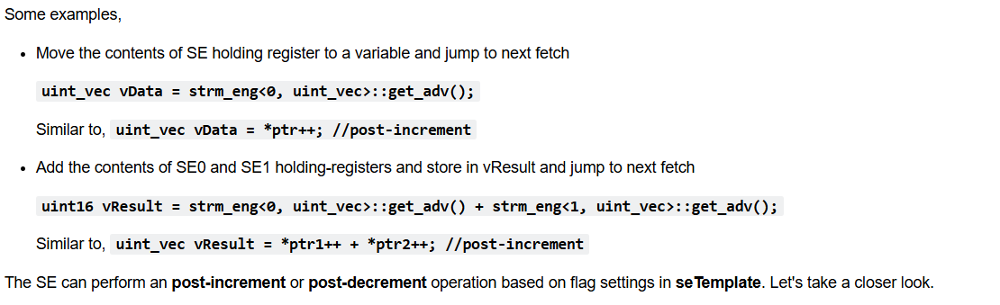
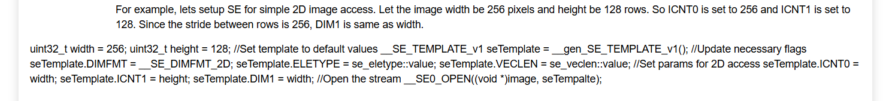
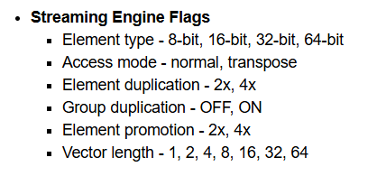

# SE for Programming
- It act as a speed bridge between the cpu functional unit and memory(l2,l3)
- 512 bits per cycle
- Has holding register
- Its only read only
- We cant write in the holding register


# SE c7x
### c7x has 2 holding register (SE0, SE1)

---

---
- it works as a pointer
- so before using it we must give the base address from where the addresss can be streamed

- Once a stream is OPEN the SE will populate the register with 512-bits of data from the base address. To fetch the next 512-bits, the stream should be advanced to the next location.
- It is done by post increment (get_adv())


# SE Template
- it is a 512 bit register which holds various attributes like
- <b>Type of data being streamed
- Iteration counts
- Access patterns
- Formatting options
- Linear access, Transpose access and so on...</b>

# SE Default Template


```
__SE_TEMPLATE_v1 seTemplate = __gen_SE_TEMPLATE_v1();
```

 

 ## Flags
 