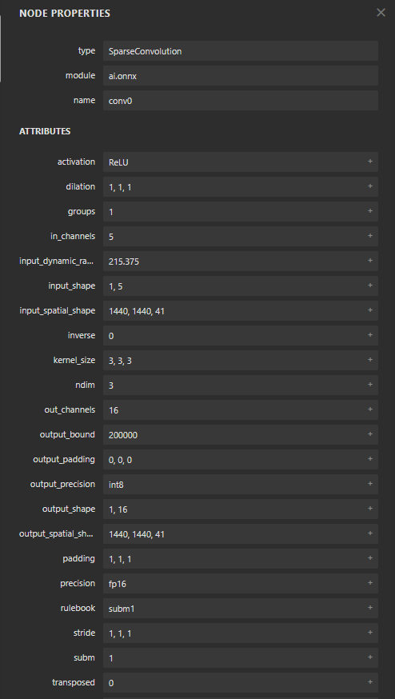

# Submanifold Sparse Convolution

- input 1x5 (batch , no. Features (channels))



- The inputs for sparse convolution is :
- The active region coordinates.
```
[0, 10, 20, 5],  # [batch_index, z, y, x]
```
- The Features in the coordinates.
```
[0.1, 0.2, 0.3, 0.4, 0.5],  # 5 values → 5 channels at (10,20,5)
```
- Spatial dimensions.
```
1440x1440x41 (height x width x depth)
```