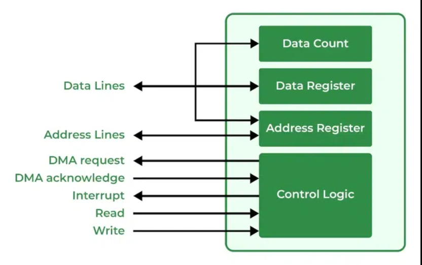
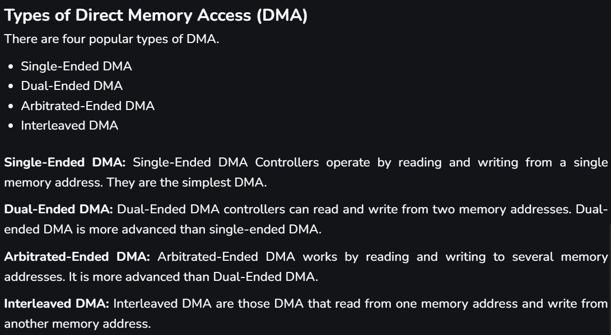
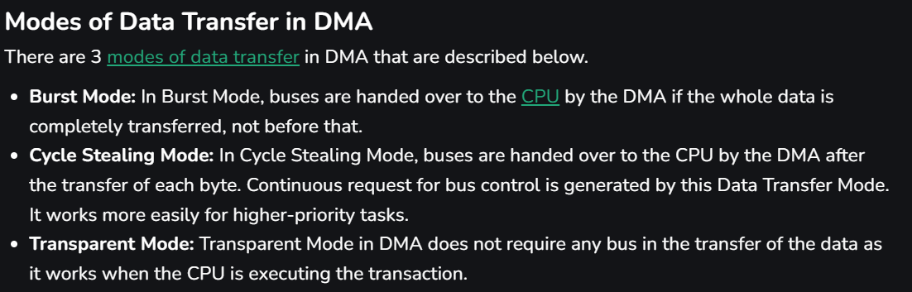
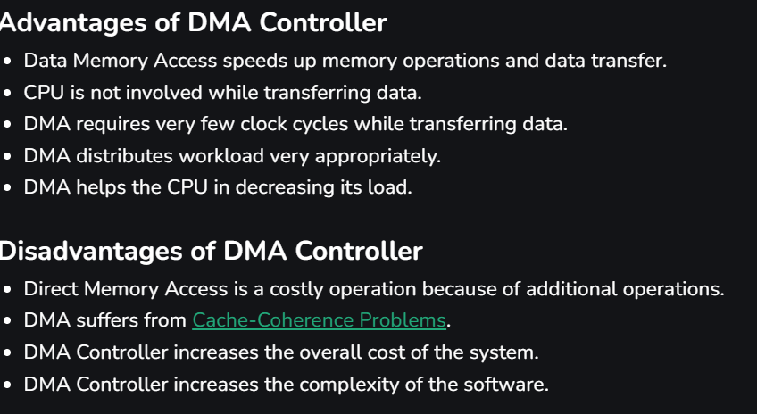

# DMA (Direct Memory Acess)

transferring data between input/output devices and memory can be a slow process if the CPU is required to manage every step 
A Direct Memory Access (DMA) Controller solves this by <b>allowing I/O devices to transfer data directly to memory, reducing CPU involvement 

----------------------

