<!-- 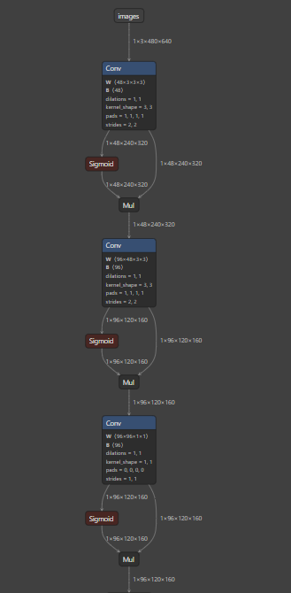 -->

# Block_1,2,3
## Onnx(Netron):
<!-- 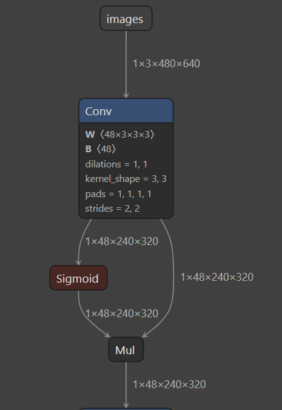 -->
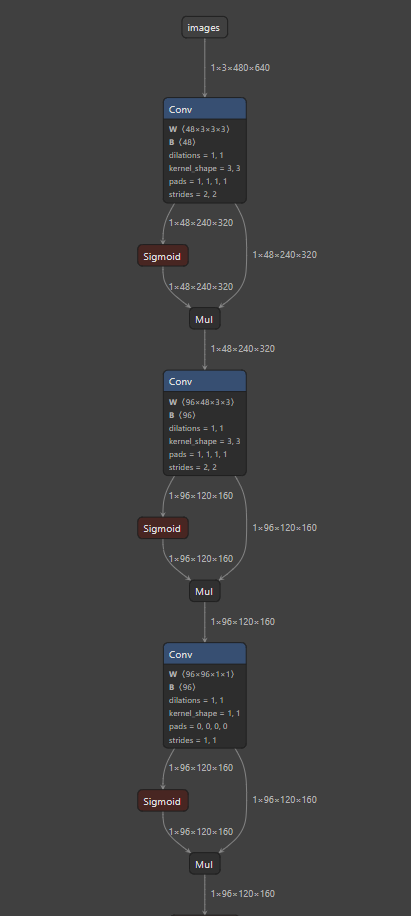
## TIDL
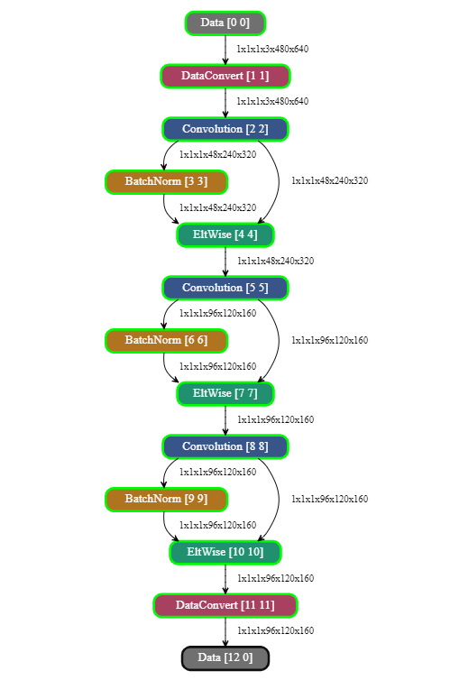

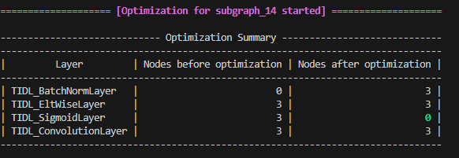
<!-- 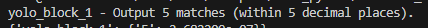 -->
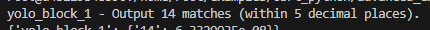

## Model Code

```python
input_shape = (480, 640, 3)

# Define the input layer
input_layer = tf.keras.Input(shape=input_shape)
#--------------------------------------------------------------------

conv_1 = tf.keras.layers.Conv2D(48, kernel_size=(3,3), strides=(2,2), padding='same', name='conv1')(input_layer)

sigmoid_1 = tf.keras.layers.Activation('sigmoid')(conv_1)

mul_1 = tf.keras.layers.Multiply()([sigmoid_1, conv_1])

#-----------------------------------------------------------------
conv_2 = tf.keras.layers.Conv2D(96, kernel_size=(3,3), strides=(2,2), padding='same', name='conv2')(mul_1)

sigmoid_2 = tf.keras.layers.Activation('sigmoid')(conv_2)

mul_2 = tf.keras.layers.Multiply()([sigmoid_2, conv_2])

#----------------------------------------------------------------------------
conv_3 = tf.keras.layers.Conv2D(96, kernel_size=(1,1), strides=(1,1), padding='valid', name='conv3')(mul_2)

sigmoid_3 = tf.keras.layers.Activation('sigmoid')(conv_3)

mul_3 = tf.keras.layers.Multiply()([sigmoid_3, conv_3])


model = tf.keras.Model(inputs= input_layer, outputs=mul_3)

converter = tf.lite.TFLiteConverter.from_keras_model(model)
tflite_model = converter.convert()

# models_path = "./"  # Update this path if needed
with open(models_path + "yolo_block_1.tflite", "wb") as f:
    f.write(tflite_model)
```

# Block_2
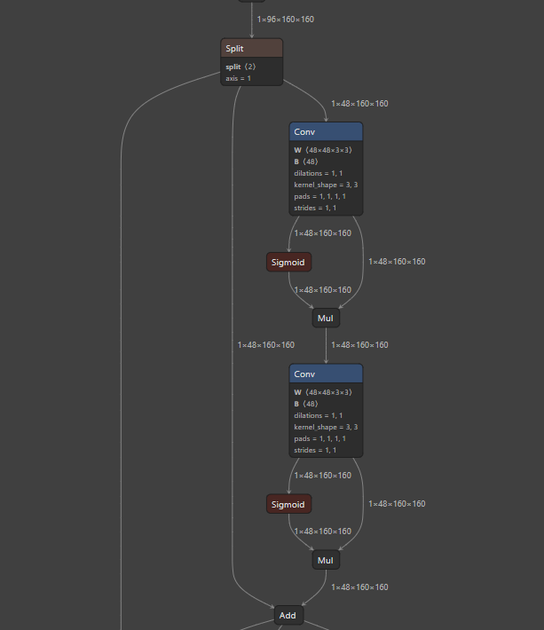
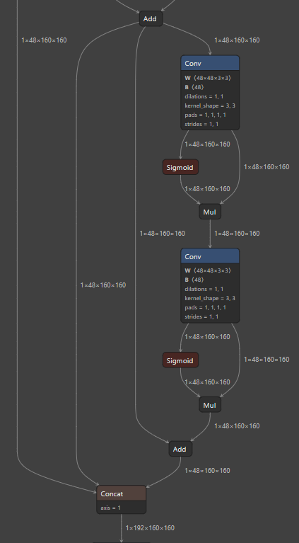

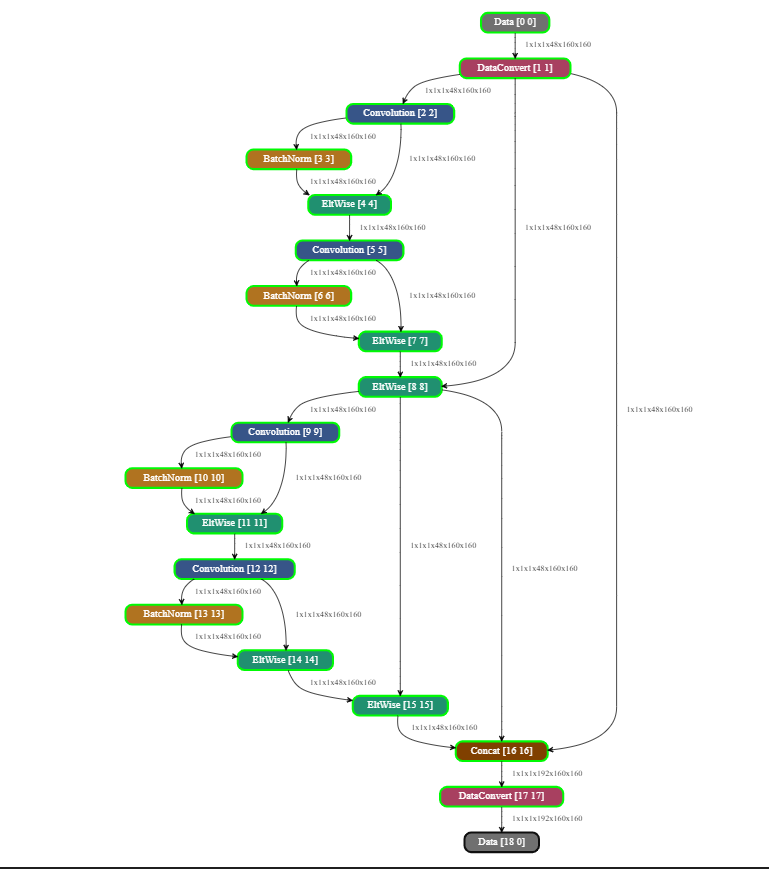

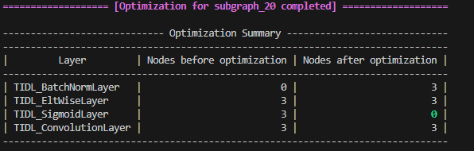
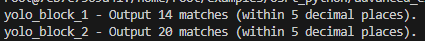


-------------------
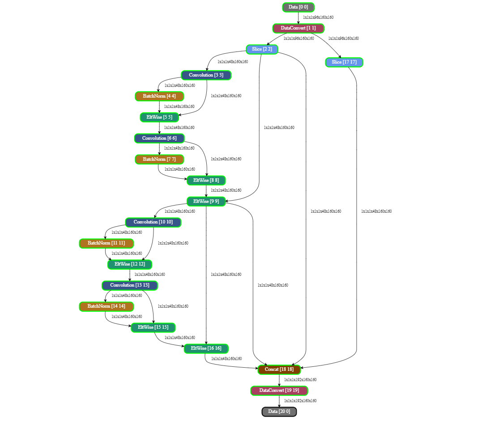

---------------
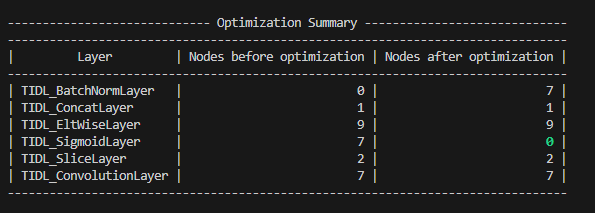
