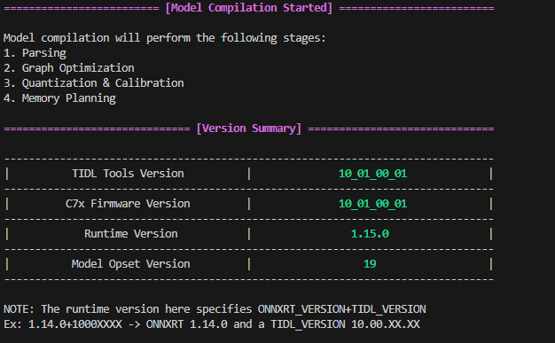
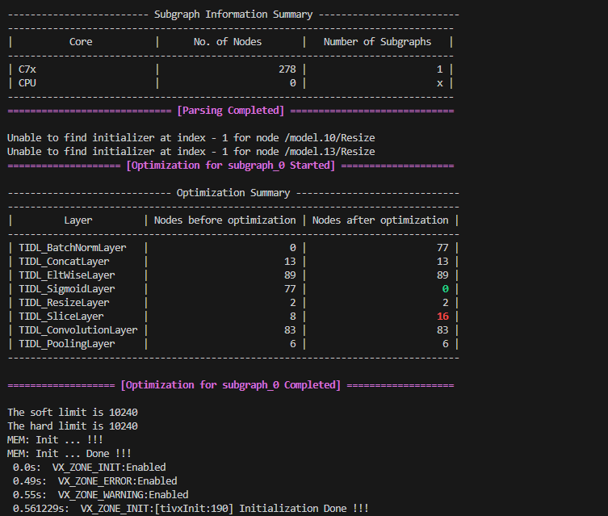
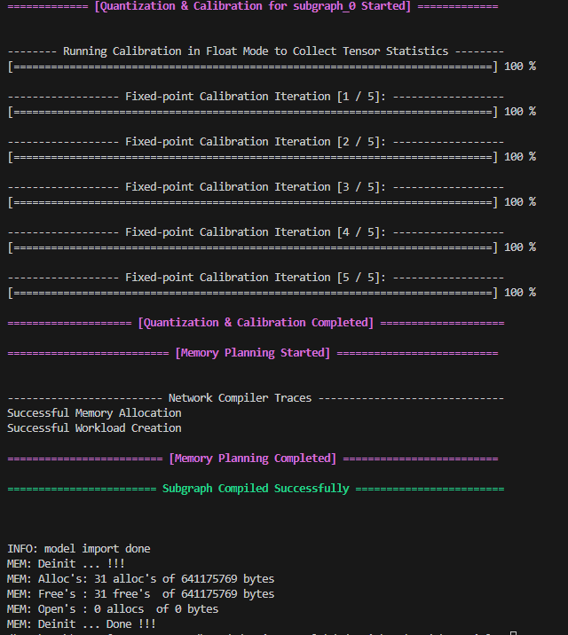
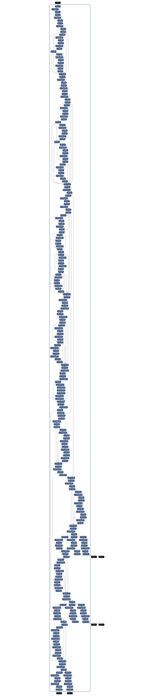

# YoloV8
We took yoloV8m.onnx model and imported to TIDL.
While doing that we found out that some layers are not supported like :
- Maxpool 5x5 with stride 1x1 
- Subraction layer
- Softmax layer

so we implemented same operation in different way like :
- using two 3x3 maxpool with stride 1x1
- using sddition layer with B tensor multiplird with -1
- for softmax we gave the input in format of 1x1x1xN and reshaped after.

----

In this yolov8m.onnx there are some problems with last few layers . So we decided to implement till the 6 convolution layer namely:

- 64x80x80 
- 80x80x80
- 64x40x40
- 80x40x40
- 64x20x20
- 80x20x20

--------

# TIDL Import

# The Final yoloV8 Onnx model.
- [Download Model](./conv_six_outputs_ir9.onnx)

